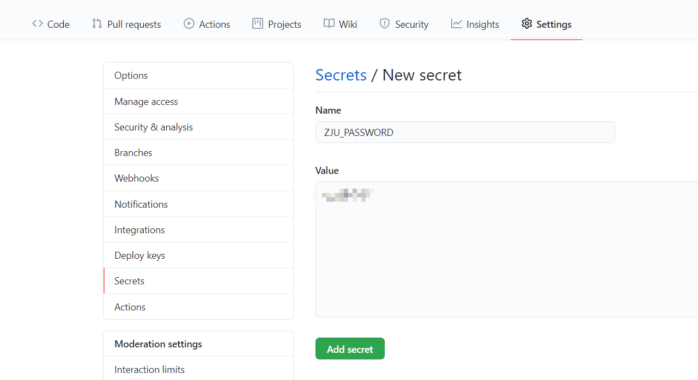
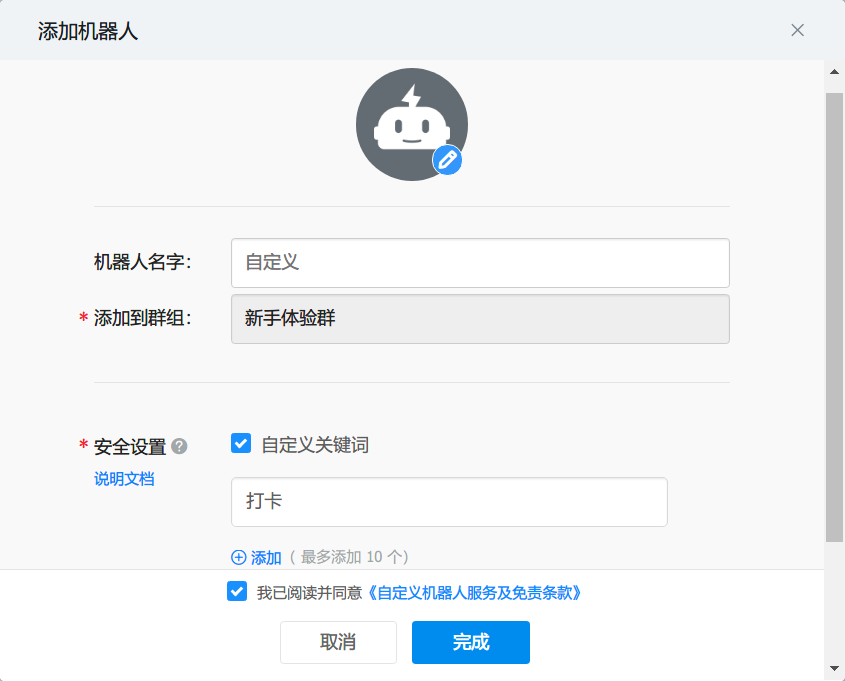
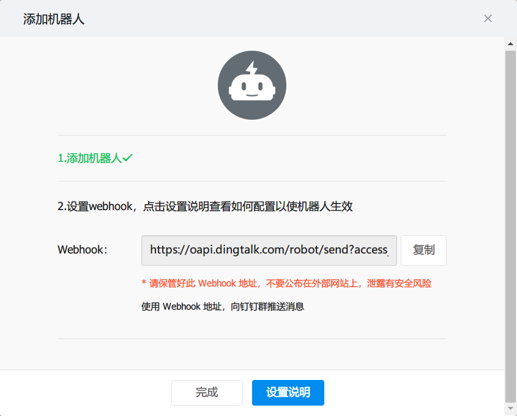
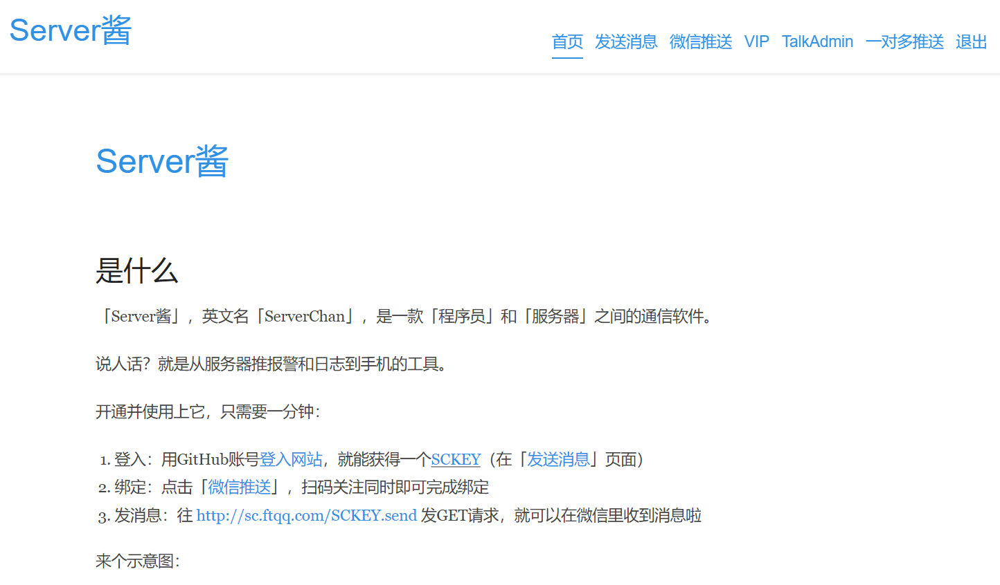
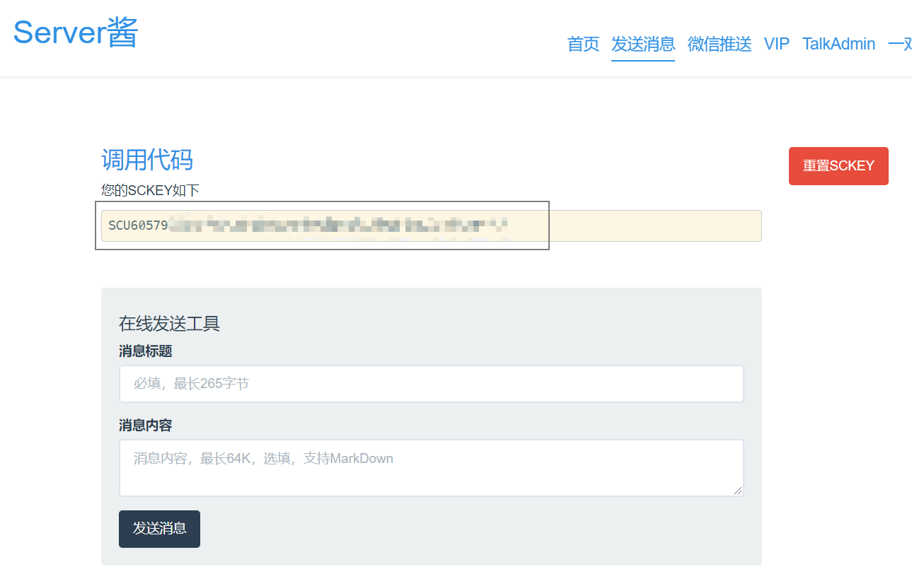
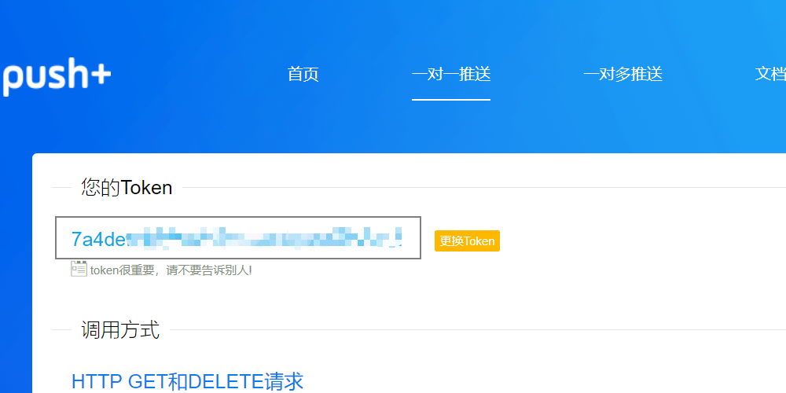
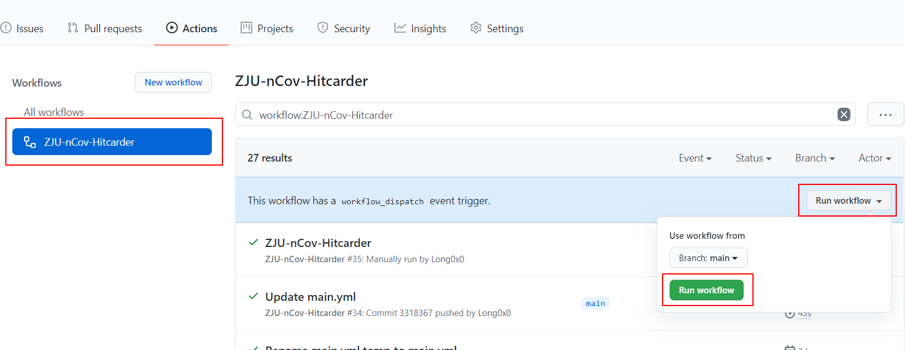
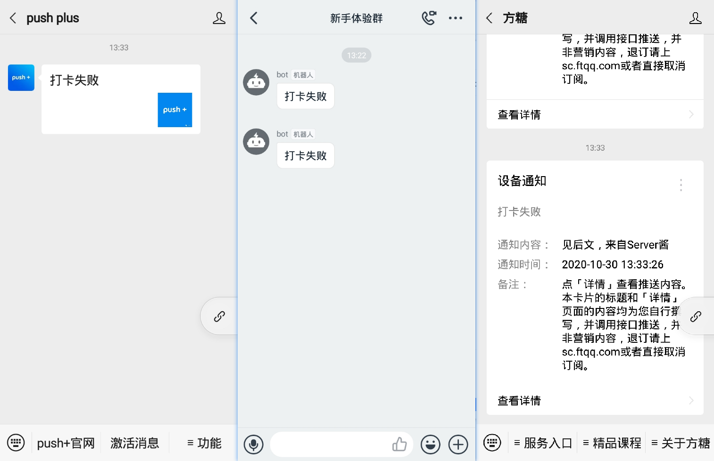
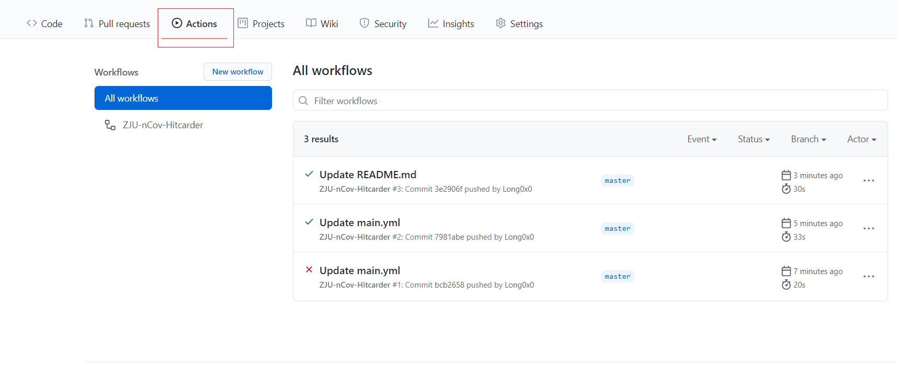
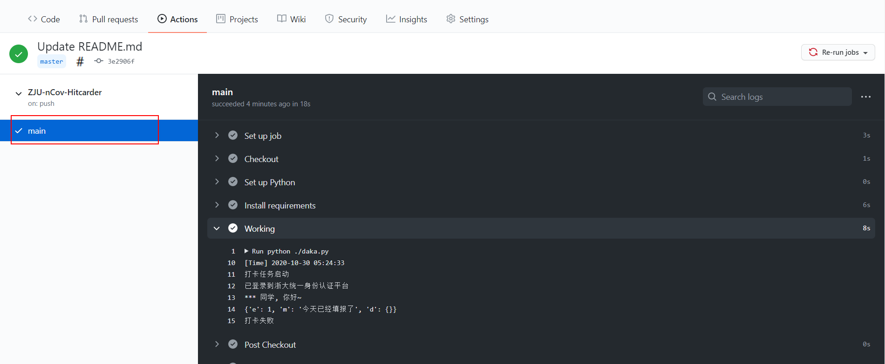

# ZJU-nCov-Hitcarder-Sample
Sample for https://github.com/Long0x0/ZJU-nCov-Hitcarder.

浙大nCov肺炎健康打卡定时自动脚本 

forked from [Tishacy/ZJU-nCov-Hitcarder](https://github.com/Tishacy/ZJU-nCov-Hitcarder)


 - 使用 Github Actions 实现定时打卡，无需本地运行或部署在VPS
 - 打卡完成后可发送打卡成功或失败的微信/钉钉消息
 - 默认每次提交上次所提交的内容（只有时间部分更新）
 - 系统表单如有更新，在当天自行手机打卡，后面会自动按照你更新后的选项继续打卡
 - **项目用于学习交流，仅用于各项无异常时打卡，如有身体不适、所在地点改变等情况还请自行如实打卡！**


> 感谢[conv1d](https://github.com/conv1d)同学，已使用requests直接登录浙大统一认证平台，不再依赖phantomjs

## Usage

1. fork本项目，~~将 .github\workflows\main.yml.temp 更名为 main.yml~~。
   
2. 配置帐号
   
   在项目的 Settings-Secrets 中添加 `ZJU_USERNAME`，内容为浙大通行证账号（学号），添加`ZJU_PASSWORD`，内容为浙大通行证密码。

   

   

3. 配置定运行时间
   
   在 .github\workflows\main.yml 中更改时间：
   ```yml
   on:
      workflow_dispatch:
      schedule:
         - cron: '0 23 * * *'
   ```
   `workflow_dispatch`表示可以手动运行，`0 23 * * *`表示在每天UTC 23:00，也就是北京时间7:00运行。如果你想在每天早上9:30打卡，那么就应该设置为`30 1 * * *`。详见[这里](https://docs.github.com/en/free-pro-team@latest/actions/reference/events-that-trigger-workflows#scheduled-events)。
   
   PS:经过测试，实际运行时间比设定时间晚几分钟到几十分钟，~~原因大概是白嫖的人太多，github actions的服务器不够用了。。~~

4. 配置提醒方式（以下三种任选其一即可）
   
   <details>
     <summary>钉钉群机器人（PC端操作）</summary>
      
      - 打开新手体验群~~或者一个课程群~~，群设置-智能群助手-添加机器人-自定义，名字随便填，安全设置选择`自定义关键词`，填`打卡`，然后下一步复制Webhook。

         

         

      - 在github项目的 Settings-Secrets 中中添加`DINGTALK_TOKEN`，内容为刚才复制的Webhook中 `access_token=` 后面的内容。

   </details>


   <details>
     <summary>微信ServerChan推送</summary>

      - 前往 http://sc.ftqq.com/3.version ，按首页的提示用GitHub账号登录，绑定微信，即可获得SCKEY。

         

         

      - 在github项目的 Settings-Secrets 中中添加`SERVERCHAN_KEY`，内容为刚才复制的SCKEY。

   </details>


   <details>
     <summary>微信PUSHPLUS推送</summary>

      - 前往 https://pushplus.hxtrip.com ，微信扫码，点击激活消息，复制token。

         

      - 在github项目的 Settings-Secrets 中中添加`PUSHPLUS_TOKEN`，内容为刚才复制的token。


   </details>


5. 配置多人打卡

   可选，在 .github\workflows\main.yml 中添加一组，自行添加对应的Secrets。

   ```yml
      - username: ZJU_USERNAME
        password: ZJU_PASSWORD
        dingtalk_token: DINGTALK_TOKEN
        pushplus_token: PUSHPLUS_TOKEN
        serverchan_key: SERVERCHAN_KEY
      - username: ZJU_USERNAME2
        password: ZJU_PASSWORD2
        dingtalk_token: DINGTALK_TOKEN2
        pushplus_token: PUSHPLUS_TOKEN2
        serverchan_key: SERVERCHAN_KEY2
   ```


6. 测试
   
   Actions - ZJU-nCov-Hitcarder-Sample - Run workflow 运行测试。如果打卡成功，你将收到“打卡成功”的钉钉/微信消息，如果打卡失败或者今日已打卡，你将收到“打卡失败”。

   

   

   查看log：

   
   
   


## Thanks

感谢原项目作者和贡献者

## 参考链接
GitHub Actions https://docs.github.com/en/free-pro-team@latest/actions

钉钉群机器人 https://ding-doc.dingtalk.com/doc#/serverapi3/iydd5h

ServerChan http://sc.ftqq.com/3.version

pushplus https://pushplus.hxtrip.com


## LICENSE

Copyright (c) 2020 tishacy.

Licensed under the [MIT License](https://github.com/Tishacy/ZJU-nCov-Hitcarder/blob/master/LICENSE)

